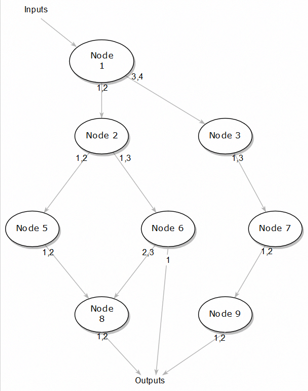

# XStream Python API

## 介绍
XStream Python API 为XStream框架功能在Python的封装, 通过它可以方便快速地定义XStream Workflow.

## 使用
### 创建简单的workflow
Workflow在Python中是用函数的方式来表示的. 比如定义一个简单的workflow:
```python
import xstream

frcnn_method = xstream.Method("FasterRCNNMethod").Inputs(["image"]).Outputs(["face_box", "head_box", "body_box", "kps"]).Config("multitask_config.json")
mot_method = xstream.Method("MOTMethod").Inputs(["face_box"]).Outputs(["face_bbox_list", "face_disappeared_track_id_list"])

def my_workflow(image):
    face_box, head_box, body_box, kps = frcnn_method(image)
    face_bbox_list, face_disappeared_track_id_list = mot_method(face_box)

    return face_bbox_list, face_disappeared_track_id_list

json = xstream.Serialize(my_workflow)
print(json)
```
执行之后会生成如下json:
```json
{
    "inputs":[
        "image"
    ],
    "outputs":[
        "face_bbox_list",
        "face_disappeared_track_id_list"
    ],
    "workflow":[
        {
            "inputs":[
                "image"
            ],
            "method_config_file":"multitask_config.json",
            "method_type":"FasterRCNNMethod",
            "outputs":[
                "FasterRCNNMethod_0_face_box",
                "FasterRCNNMethod_0_head_box",
                "FasterRCNNMethod_0_body_box",
                "FasterRCNNMethod_0_kps"
            ],
            "thread_count":1,
            "unique_name":"FasterRCNNMethod_0"
        },
        {
            "inputs":[
                "FasterRCNNMethod_0_face_box"
            ],
            "method_config_file":"",
            "method_type":"MOTMethod",
            "outputs":[
                "face_bbox_list",
                "face_disappeared_track_id_list"
            ],
            "thread_count":1,
            "unique_name":"MOTMethod_0"
        }
    ]
}
```
### 包含子workflow
在Python中,每一个workflow都是用python函数来表示,那么当然也是可以通过python函数调用的方式,调用子workflow.
子workflow和其他workflow的形式相同,只是他们处在的位置不同.
```python
import xstream

frcnn_method = xstream.Method("FasterRCNNMethod").Inputs(["image"])

rect_method = xstream.Method("rect_pre").Inputs(["face_box", "image"]).Outputs(["rect"]).MethodConfig("pose_lmk.json")
lmkpose_method = xstream.Method("lmkpose_post").Inputs(["rect"]).Outputs(["lmk", "pose"]).MethodConfig("pose_lmk.json")

# 创建workflow2, 其实就是子workflow
def my_workflow2(image):
        face_box, head_box, body_box, reid, kps, mask = frcnn_method(
            image,
            Outputs=["face_box", "head_box", "body_box", "reid", "kps", "mask"],
            MethodConfig="fasterrcnndet.json"
        )

        rect = rect_method(face_box, image)
        lmk, pose = lmkpose_method(rect)

        return face_box, head_box, body_box, reid, lmk, pose

# 总workflow
def all_workflow(image):
    face_box, head_box, body_box, kps = frcnn_method(
        image,
        Outputs=["face_box", "head_box", "body_box", "kps"],
        MethodConfig="multitask_config.json",
        ThreadCount=2
    )
    rect = rect_method(face_box, image)

    face_box2, head_box2, body_box2, reid, lmk, pose = my_workflow2(image)

    return face_box, head_box2, rect, lmk, pose

json = xstream.Serialize(all_workflow)
print(json)

```
执行后会生成如下json:
```json
{
    "inputs":[
        "image"
    ],
    "outputs":[
        "face_box",
        "head_box",
        "rect",
        "lmk",
        "pose"
    ],
    "workflow":[
        {
            "inputs":[
                "image"
            ],
            "method_config_file":"multitask_config.json",
            "method_type":"FasterRCNNMethod",
            "outputs":[
                "face_box",
                "FasterRCNNMethod_0_head_box",
                "FasterRCNNMethod_0_body_box",
                "FasterRCNNMethod_0_kps"
            ],
            "thread_count":2,
            "unique_name":"FasterRCNNMethod_0"
        },
        {
            "inputs":[
                "face_box",
                "image"
            ],
            "method_config_file":"pose_lmk.json",
            "method_type":"rect_pre",
            "outputs":[
                "rect"
            ],
            "thread_count":1,
            "unique_name":"rect_pre_0"
        },
        {
            "inputs":[
                "image"
            ],
            "method_config_file":"fasterrcnndet.json",
            "method_type":"FasterRCNNMethod",
            "outputs":[
                "FasterRCNNMethod_1_face_box",
                "head_box",
                "FasterRCNNMethod_1_body_box",
                "FasterRCNNMethod_1_reid",
                "FasterRCNNMethod_1_kps",
                "FasterRCNNMethod_1_mask"
            ],
            "thread_count":1,
            "unique_name":"FasterRCNNMethod_1"
        },
        {
            "inputs":[
                "FasterRCNNMethod_1_face_box",
                "image"
            ],
            "method_config_file":"pose_lmk.json",
            "method_type":"rect_pre",
            "outputs":[
                "rect_pre_1_rect"
            ],
            "thread_count":1,
            "unique_name":"rect_pre_1"
        },
        {
            "inputs":[
                "rect_pre_1_rect"
            ],
            "method_config_file":"pose_lmk.json",
            "method_type":"lmkpose_post",
            "outputs":[
                "lmk",
                "pose"
            ],
            "thread_count":1,
            "unique_name":"lmkpose_post_0"
        }
    ]
}
```
### 名字空间
当一个workflow比较大时,workflow中所有输入输出, Method的唯一名字等就会容易冲突, 为了解决该问题, 在定义workflow时提出了scope概念.
```python
import xstream

frcnn_method = xstream.Method("FasterRCNNMethod").Inputs(["image"])

rect_method = xstream.Method("rect_pre").Inputs(["face_box", "image"]).Outputs(["rect"]).MethodConfig("pose_lmk.json")
lmkpose_method = xstream.Method("lmkpose_post").Inputs(["rect"]).Outputs(["lmk", "pose"]).MethodConfig("pose_lmk.json")

# 创建workflow2, 其实就是子workflow
def my_workflow2(image):
        face_box, head_box, body_box, reid, kps, mask = frcnn_method(
            image,
            Outputs=["face_box", "head_box", "body_box", "reid", "kps", "mask"],
            MethodConfig="fasterrcnndet.json"
        )
        with xstream.Scope("scope2"):
            rect = rect_method(face_box, image)
            lmk, pose = lmkpose_method(rect)
            return face_box, head_box, body_box, reid, lmk, pose

# 总workflow
def all_workflow(image):
    face_box, head_box, body_box, kps = frcnn_method(
        image,
        Outputs=["face_box", "head_box", "body_box", "kps"],
        MethodConfig="multitask_config.json",
        ThreadCount=2
    )
    with xstream.Scope("scope1"):
        rect = rect_method(face_box, image)
        face_box2, head_box2, body_box2, reid, lmk, pose = my_workflow2(image)

    return face_box, head_box2, rect, lmk, pose

json = xstream.Serialize(all_workflow)
print(json)
```
执行后会生成如下json:
```json
{
    "inputs":[
        "image"
    ],
    "outputs":[
        "face_box",
        "head_box",
        "rect",
        "lmk",
        "pose"
    ],
    "workflow":[
        {
            "inputs":[
                "image"
            ],
            "method_config_file":"multitask_config.json",
            "method_type":"FasterRCNNMethod",
            "outputs":[
                "face_box",
                "FasterRCNNMethod_0_head_box",
                "FasterRCNNMethod_0_body_box",
                "FasterRCNNMethod_0_kps"
            ],
            "thread_count":2,
            "unique_name":"FasterRCNNMethod_0"
        },
        {
            "inputs":[
                "face_box",
                "image"
            ],
            "method_config_file":"pose_lmk.json",
            "method_type":"rect_pre",
            "outputs":[
                "rect"
            ],
            "thread_count":1,
            "unique_name":"scope1_rect_pre_0"
        },
        {
            "inputs":[
                "image"
            ],
            "method_config_file":"fasterrcnndet.json",
            "method_type":"FasterRCNNMethod",
            "outputs":[
                "scope1_FasterRCNNMethod_1_face_box",
                "head_box",
                "scope1_FasterRCNNMethod_1_body_box",
                "scope1_FasterRCNNMethod_1_reid",
                "scope1_FasterRCNNMethod_1_kps",
                "scope1_FasterRCNNMethod_1_mask"
            ],
            "thread_count":1,
            "unique_name":"scope1_FasterRCNNMethod_1"
        },
        {
            "inputs":[
                "scope1_FasterRCNNMethod_1_face_box",
                "image"
            ],
            "method_config_file":"pose_lmk.json",
            "method_type":"rect_pre",
            "outputs":[
                "scope1_scope2_rect_pre_1_rect"
            ],
            "thread_count":1,
            "unique_name":"scope1_scope2_rect_pre_1"
        },
        {
            "inputs":[
                "scope1_scope2_rect_pre_1_rect"
            ],
            "method_config_file":"pose_lmk.json",
            "method_type":"lmkpose_post",
            "outputs":[
                "lmk",
                "pose"
            ],
            "thread_count":1,
            "unique_name":"scope1_scope2_lmkpose_post_0"
        }
    ]
}
```
可以看出, rect_pre method的第一个实例scope1_rect_pre_0已经加上了scope1前缀. 进入到子workflow中, method实例的unique name, inputs和outputs中都加上了scope1.
在scope中再创建一个scope也是可以的. 所有scope的名字都会一起作为前缀.

### 一个更复杂的例子
如下图描述的一个workflow:

用python表示的代码如下(sub_workflow函数):
```python
import xstream

node1 = xstream.Method("Node_1").Inputs(["data1"]).Outputs(["data1", "data2", "data3", "data4"])
node1.MethodConfig("Node1_cfg.json").ThreadCount(2)
node2 = xstream.Method("Node_2").Inputs(["data1", "data2"]).Outputs(["data1", "data2", "data3"])
node3 = xstream.Method("Node_3").Inputs(["data3", "data4"]).Outputs(["data1", "data2", "data3"])

node5 = xstream.Method("Node_5").Inputs(["data1", "data2"]).Outputs(["data1", "data2", "data3"])
node6 = xstream.Method("Node_6").Inputs(["data1", "data3"]).Outputs(["data1", "data2", "data3"])
node7 = xstream.Method("Node_7").Inputs(["data1", "data3"]).Outputs(["data1", "data2", "data3"])
node8 = xstream.Method("Node_8").Inputs(["data1", "data2", "data2", "data3"]).Outputs(["data1", "data2", "data3"])
node9 = xstream.Method("Node_9").Inputs(["data1", "data2"]).Outputs(["data1", "data2", "data3"])

cnn_method = xstream.Method("CNNMethod").Inputs(["image"])

# 创建workflow
def sub_workflow(data1):
    data1_1, data2_1, data3_1, data4_1 = node1(data1)

    with xstream.Scope("pre1"):
        # node1的下一级
        data1_2, data2_2, data3_2 = node2(data1_1, data2_1)
        data1_3, data2_3, data3_3 = node3(data3_1, data4_1)

        with xstream.Scope("pre2"):
            # node2的下一级
            data1_5, data2_5, data3_5 = node5(data1_2, data2_2)
            data1_6, data2_6, data3_6 = node6(data1_2, data3_2)

            # node3的下一级
            data1_7, data2_7, data3_7 = node7(data1_3, data3_3)

        # node5 node6的下一级
        data1_8, data2_8, data3_8 = node8(data1_5, data2_5, data2_6, data3_6)

    # node7的下一级
    data1_9, data2_9, data3_9 = node9(data1_7, data2_7)

    # 返回当前工作流的结果
    return data1_8, data2_8, data1_6, data1_9, data2_9

def my_workflow(image):
    lmk = cnn_method(image, Outputs=["data1"], MethodConfig="cnn_cfg.json")
    out1, out2, out3, out4, out5 = sub_workflow(lmk)
    eyes = cnn_method(out2, out3, Inputs=["data2", "data1"], Outputs=["eyes"], MethodConfig="cnn_cfg2.json")

    return eyes, out4

# 将workflow序列化成json
jsondata = xstream.Serialize(my_workflow) # 可以对其写入至文件等
print(jsondata)
```
执行以上代码生成如下json:
```json
{
    "inputs":[
        "image"
    ],
    "outputs":[
        "eyes",
        "data1"
    ],
    "workflow":[
        {
            "inputs":[
                "image"
            ],
            "method_config_file":"cnn_cfg.json",
            "method_type":"CNNMethod",
            "outputs":[
                "CNNMethod_0_data1"
            ],
            "thread_count":1,
            "unique_name":"CNNMethod_0"
        },
        {
            "inputs":[
                "CNNMethod_0_data1"
            ],
            "method_config_file":"Node1_cfg.json",
            "method_type":"Node_1",
            "outputs":[
                "Node_1_0_data1",
                "Node_1_0_data2",
                "Node_1_0_data3",
                "Node_1_0_data4"
            ],
            "thread_count":2,
            "unique_name":"Node_1_0"
        },
        {
            "inputs":[
                "Node_1_0_data1",
                "Node_1_0_data2"
            ],
            "method_config_file":"null",
            "method_type":"Node_2",
            "outputs":[
                "pre1_Node_2_0_data1",
                "pre1_Node_2_0_data2",
                "pre1_Node_2_0_data3"
            ],
            "thread_count":1,
            "unique_name":"pre1_Node_2_0"
        },
        {
            "inputs":[
                "Node_1_0_data3",
                "Node_1_0_data4"
            ],
            "method_config_file":"null",
            "method_type":"Node_3",
            "outputs":[
                "pre1_Node_3_0_data1",
                "pre1_Node_3_0_data2",
                "pre1_Node_3_0_data3"
            ],
            "thread_count":1,
            "unique_name":"pre1_Node_3_0"
        },
        {
            "inputs":[
                "pre1_Node_3_0_data1",
                "pre1_Node_3_0_data3"
            ],
            "method_config_file":"null",
            "method_type":"Node_7",
            "outputs":[
                "pre1_pre2_Node_7_0_data1",
                "pre1_pre2_Node_7_0_data2",
                "pre1_pre2_Node_7_0_data3"
            ],
            "thread_count":1,
            "unique_name":"pre1_pre2_Node_7_0"
        },
        {
            "inputs":[
                "pre1_pre2_Node_7_0_data1",
                "pre1_pre2_Node_7_0_data2"
            ],
            "method_config_file":"null",
            "method_type":"Node_9",
            "outputs":[
                "data1",
                "Node_9_0_data2",
                "Node_9_0_data3"
            ],
            "thread_count":1,
            "unique_name":"Node_9_0"
        },
        {
            "inputs":[
                "pre1_Node_2_0_data1",
                "pre1_Node_2_0_data2"
            ],
            "method_config_file":"null",
            "method_type":"Node_5",
            "outputs":[
                "pre1_pre2_Node_5_0_data1",
                "pre1_pre2_Node_5_0_data2",
                "pre1_pre2_Node_5_0_data3"
            ],
            "thread_count":1,
            "unique_name":"pre1_pre2_Node_5_0"
        },
        {
            "inputs":[
                "pre1_Node_2_0_data1",
                "pre1_Node_2_0_data3"
            ],
            "method_config_file":"null",
            "method_type":"Node_6",
            "outputs":[
                "pre1_pre2_Node_6_0_data1",
                "pre1_pre2_Node_6_0_data2",
                "pre1_pre2_Node_6_0_data3"
            ],
            "thread_count":1,
            "unique_name":"pre1_pre2_Node_6_0"
        },
        {
            "inputs":[
                "pre1_pre2_Node_5_0_data1",
                "pre1_pre2_Node_5_0_data2",
                "pre1_pre2_Node_6_0_data2",
                "pre1_pre2_Node_6_0_data3"
            ],
            "method_config_file":"null",
            "method_type":"Node_8",
            "outputs":[
                "pre1_Node_8_0_data1",
                "pre1_Node_8_0_data2",
                "pre1_Node_8_0_data3"
            ],
            "thread_count":1,
            "unique_name":"pre1_Node_8_0"
        },
        {
            "inputs":[
                "pre1_Node_8_0_data2",
                "pre1_pre2_Node_6_0_data1"
            ],
            "method_config_file":"cnn_cfg2.json",
            "method_type":"CNNMethod",
            "outputs":[
                "eyes"
            ],
            "thread_count":1,
            "unique_name":"CNNMethod_1"
        }
    ]
}
```
### 冗余节点删除
还拿上面那个例子来说, 将my_workflow的out4输出删除,如下代码:
```python
def my_workflow(image):
    lmk = cnn_method(image, Outputs=["data1"], MethodConfig="cnn_cfg.json")
    out1, out2, out3, out4, out5 = sub_workflow(lmk)
    eyes = cnn_method(out2, out3, Inputs=["data2", "data1"], Outputs=["eyes"], MethodConfig="cnn_cfg2.json")

    # 删除 out4
    return eyes
```
out4其实是Node9输出的data1, 是经过input->Node1->Node3->Node7->Node9产生的, 当最终workflow没有输出out4时, 也就是说上面的3,7,9节点路径其实是不需要走的. 所以上面这条路径其实是冗余的, 需要删除它以节约系统计算资源.
xstream.Serialize会判断哪些路径是冗余的,然后删除这些路径上面的节点.
生成json如下:
```json
{
    "inputs":[
        "image"
    ],
    "outputs":[
        "eyes"
    ],
    "workflow":[
        {
            "inputs":[
                "image"
            ],
            "method_config_file":"cnn_cfg.json",
            "method_type":"CNNMethod",
            "outputs":[
                "CNNMethod_0_data1"
            ],
            "thread_count":1,
            "unique_name":"CNNMethod_0"
        },
        {
            "inputs":[
                "CNNMethod_0_data1"
            ],
            "method_config_file":"Node1_cfg.json",
            "method_type":"Node_1",
            "outputs":[
                "Node_1_0_data1",
                "Node_1_0_data2",
                "Node_1_0_data3",
                "Node_1_0_data4"
            ],
            "thread_count":2,
            "unique_name":"Node_1_0"
        },
        {
            "inputs":[
                "Node_1_0_data1",
                "Node_1_0_data2"
            ],
            "method_config_file":"null",
            "method_type":"Node_2",
            "outputs":[
                "pre1_Node_2_0_data1",
                "pre1_Node_2_0_data2",
                "pre1_Node_2_0_data3"
            ],
            "thread_count":1,
            "unique_name":"pre1_Node_2_0"
        },
        {
            "inputs":[
                "pre1_Node_2_0_data1",
                "pre1_Node_2_0_data2"
            ],
            "method_config_file":"null",
            "method_type":"Node_5",
            "outputs":[
                "pre1_pre2_Node_5_0_data1",
                "pre1_pre2_Node_5_0_data2",
                "pre1_pre2_Node_5_0_data3"
            ],
            "thread_count":1,
            "unique_name":"pre1_pre2_Node_5_0"
        },
        {
            "inputs":[
                "pre1_Node_2_0_data1",
                "pre1_Node_2_0_data3"
            ],
            "method_config_file":"null",
            "method_type":"Node_6",
            "outputs":[
                "pre1_pre2_Node_6_0_data1",
                "pre1_pre2_Node_6_0_data2",
                "pre1_pre2_Node_6_0_data3"
            ],
            "thread_count":1,
            "unique_name":"pre1_pre2_Node_6_0"
        },
        {
            "inputs":[
                "pre1_pre2_Node_5_0_data1",
                "pre1_pre2_Node_5_0_data2",
                "pre1_pre2_Node_6_0_data2",
                "pre1_pre2_Node_6_0_data3"
            ],
            "method_config_file":"null",
            "method_type":"Node_8",
            "outputs":[
                "pre1_Node_8_0_data1",
                "pre1_Node_8_0_data2",
                "pre1_Node_8_0_data3"
            ],
            "thread_count":1,
            "unique_name":"pre1_Node_8_0"
        },
        {
            "inputs":[
                "pre1_Node_8_0_data2",
                "pre1_pre2_Node_6_0_data1"
            ],
            "method_config_file":"cnn_cfg2.json",
            "method_type":"CNNMethod",
            "outputs":[
                "eyes"
            ],
            "thread_count":1,
            "unique_name":"CNNMethod_1"
        }
    ]
}
```
通过最终生成的json可以看出, workflow中不包含Node3,Node7和Node9.
## xstream包接口介绍
### 全局函数
#### Serialize(*`workflow`*, *`*inputs`*)

该函数用来将一个python定义的workflow转换成XStream框架所能识别的Json格式的配置字符串.

**参数**
+ `workflow` : 定义workflow的python函数对象.
+ `inputs` : 该workflow的输入参数. `Variable`类型.

> *Note*
> 当一个workflow函数的参数名字与该workflow的输入数据名字相同时, `inputs`参数可以省略.

**返回值**
+ XStream框架支持的workflow json字符串

#### Scope(*`name`*)

该函数创建一个新的名字空间, 在该名字空间下, 所有workflow中定义/生成的Method, Variable的名字都会加上`name`前缀.
当有多级Scope生效时, 各级Scope的`name`会级联.

**参数**
+ `name` : 当前scope的名字.

**返回值**
+ Scope对象

> *Note*
> 该函数要和Python中的`with`关键字一起使用.

### Method类
#### \_\_init__(*`type`*)

创建一个Method对象

**参数**
+ `type` : 要创建的Method类型. Method类型一旦指定后就不可修改.

**返回值**
+ Method对象

#### Inputs(*`value`*=`None`)

设置或返回当前Method的输入数据名字列表.

**参数**
+ `value` : 字符串列表类型或者None.

**返回值**
+ 当`value`为`None`时 : 当前Method的输入参数名字列表.
+ 当`value`为字符串列表时 : 当前Method对象.

#### Outputs(*`value`*=`None`)

设置或返回当前Method的输出数据名字列表.

**参数**
+ `value` : 字符串列表类型或者None.

**返回值**
+ 当`value`为`None`时 : 当前Method的输出参数名字列表.
+ 当`value`为字符串列表时 : 当前Method对象.

#### MethodType()

返回当前Method的类型.

**参数**
+ 无.

**返回值**
+ 字符串 : 当前Method类型.

#### ConfigFile(*`value`*=`None`)

设置或返回当前Method的配置文件路径.

**参数**
+ `value` : 字符串类型或者None.

**返回值**
+ 当`value`为`None`时 : 当前Method的配置文件路径.
+ 当`value`为字符串类型时 : 当前Method对象.

#### Config(*`value`*=`None`)

设置或返回当前Method的配置参数.

**参数**
+ `value` : 字典类型或者None.

**返回值**
+ 当`value`为`None`时 : 当前Method的配置.
+ 当`value`为字典类型时 : 当前Method对象.

#### ThreadCount(*`value`*=`None`)

设置或返回当前Method的最大线程个数.

**参数**
+ `value` : 整数类型或者None.

**返回值**
+ 当`value`为`None`时 : 当前Method的最大线程数.
+ 当`value`为整数类型时 : 当前Method对象.

#### ThreadList(*`value`*=`None`)

设置或返回当前Method的线程ID列表.

**参数**
+ `value` : 整数列表类型或者None.

**返回值**
+ 当`value`为`None`时 : 当前Method的线程ID列表.
+ 当`value`为整数列表类型时 : 当前Method对象.

#### \_\_call__(*`*inputs`*,*`**attrs`*)

调用当前method对象, 每次调用代表着在workflow中创建一个节点. 同时在调用时支持覆盖声明Method对象时指定的预定义参数.

**参数**
+ `inputs` : 当前的Method的输入.
+ `attrs` : keywords arguments, 用来覆盖Method预定义参数. 支持下列参数:
    + Inputs : 输入参数名字列表
    + Outputs : 输出参数名字列表
    + UniqueName : 当前Node的唯一名字
    + ConfigFile : 配置文件路径
    + Config : 配置参数
    + ThreadCount : 线程最大个数
    + ThreadList : 线程ID列表

**返回值**
+ 当`value`为`None`时 : 当前Method的线程ID列表.
+ 当`value`为整数列表类型时 : 当前Method对象.

> *Demo*
> ```python
> import xstream
>
> # 预定义该method使用test_cnn.json这个配置文件
> method_a = xstream.Method("CNN").ConfigFile("test_cnn.json")
>
> # 覆盖预定义的ConfigFile配置
> output = method_a(inputs, ConfigFile="test_cnn_2.json")
> ```


### Variable类
#### \_\_init__(*`dataName`*)

实例化一个Variable类型的对象.Variable对象作为workflow的输入和输出数据类型.

**参数**
+ `dataName` : Variable的数据名称.

**返回值**
+ Variable对象

#### Name()

返回当前Variable的名字.

**参数**
+ 无

**返回值**
+ 字符串 : 该Variable对象的名字.
